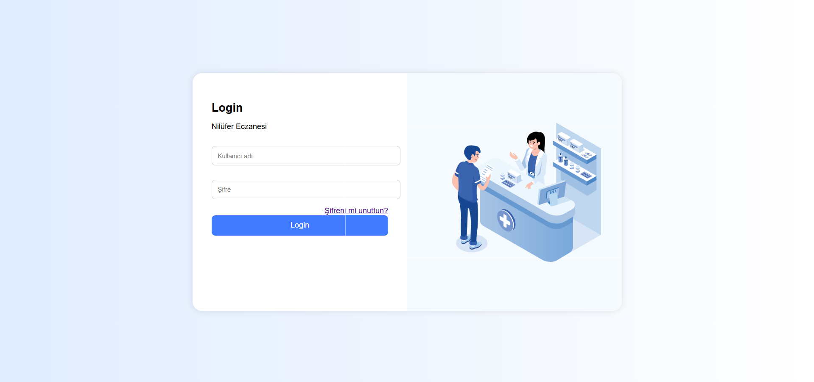
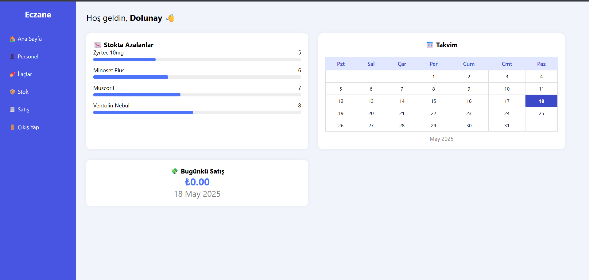
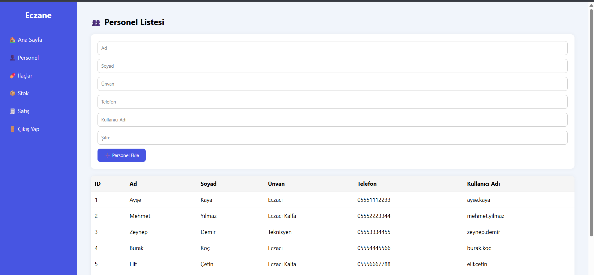
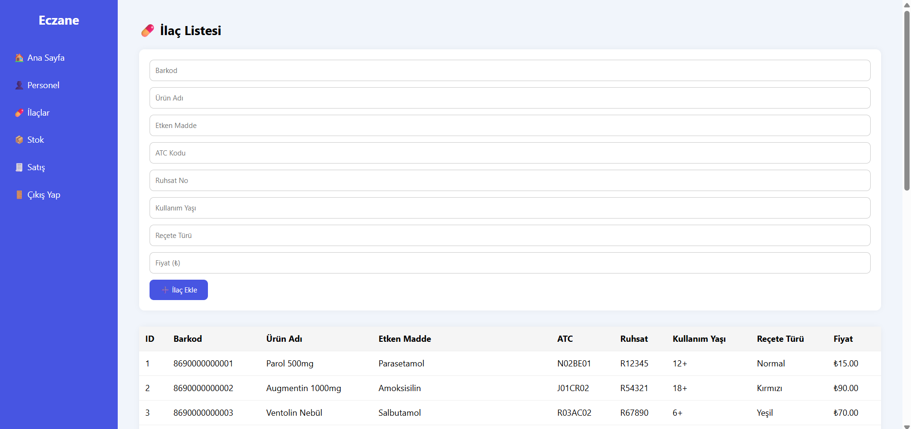
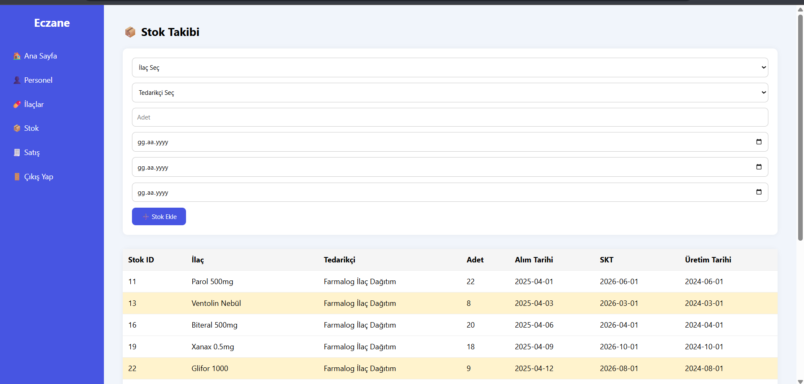
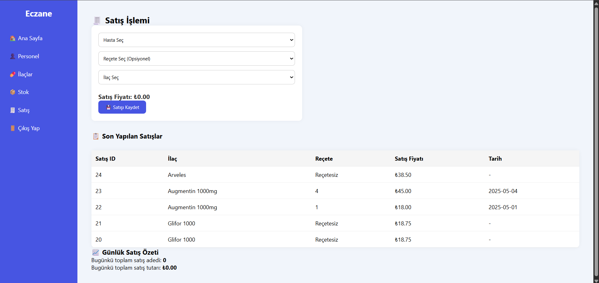
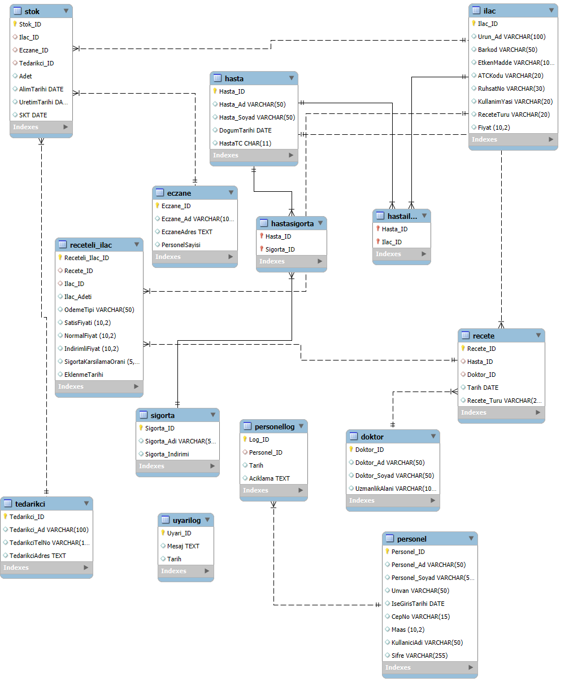

# Eczane Otomasyon Sistemi

Bu proje, bir eczanenin hasta, doktor, ilaç, reçete, stok ve satış işlemlerini dijital ortamda yönetmesini sağlayan bir otomasyon sistemidir. Proje kapsamında veritabanı, arayüz, trigger, view ve index yapıları kullanılmıştır.

## Proje Özeti

- Hasta, doktor, reçete, ilaç, stok, tedarikçi gibi temel modüller oluşturulmuştur.
- Reçete üzerinden ilaç satışı yapıldığında stoktan otomatik düşen trigger’lar geliştirilmiştir.
- Görünümler (views) ile azalan stoklar ve günlük satış özetleri takip edilmiştir.
- Tablolarda 5NF’ye uygun normalizasyon sağlanmıştır.
- Kullanıcı arayüzü PHP ile, veri yönetimi ise MySQL Workbench ve phpMyAdmin ile yapılmıştır.

## Kullanılan Teknolojiler

- MySQL
- PHP
- phpMyAdmin
- MySQL Workbench

## Projenin Kurulumu

1. `eczanevt.sql` betiğini MySQL Workbench veya phpMyAdmin ile çalıştırın.
2. `kaynak_kodlar/` klasöründeki PHP dosyalarını XAMPP `htdocs` içine atın.
3. `config.php` içindeki veritabanı bağlantı bilgilerini güncelleyin.
4. Tarayıcıdan `http://localhost/eczane` adresine giderek arayüzü test edin.

## Proje Özellikleri

- Hasta Kayıt / Güncelleme / Listeleme
- Doktor Tanımlama
- Reçete Oluşturma
- Reçeteli İlaç Satışı
- Otomatik Stok Takibi (Trigger ile)
- Azalan Stok Uyarıları (View)
- Sigorta Tipine Göre İndirimli Fiyatlandırma
- Kullanıcı Loglama (personellog)
- İndeksleme ile hızlı sorgular

## Lisans

Bu proje eğitim amaçlı hazırlanmıştır. Kocaeli Üniversitesi Bilişim Sistemleri Mühendisliği bölümü “Veri Tabanı Yönetim Sistemleri” dersi projesidir.

## 🖼 Arayüz Görselleri

### 🔐 Giriş Ekranı

### 🏠 Ana Sayfa Paneli

### 👤 Personel Yönetimi

### 💊 İlaç Listesi

### 📦 Stok Takibi

### 💰 Satış İşlemleri

## 🗺 ER Diyagramı
Veritabanı yapısını gösteren ilişkisel diyagram:

## 🧑‍💻 Geliştiriciler
- Dolunay Aksoy  
- Şükran Başaran  
- Barkın Kanbur  
